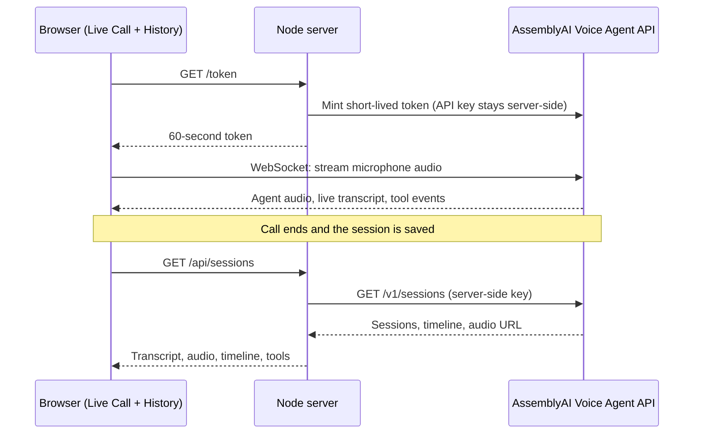

<div align="center">

# IntakeScribe

### Capture what matters before the appointment begins.

**A voice-first clinical intake prototype with a reviewable session history, built on the [AssemblyAI Voice Agent API](https://www.assemblyai.com/docs/voice-agents/voice-agent-api).**

[](https://lablab.ai/ai-hackathons/assemblyai-voice-agent-hackathon)
[](https://www.assemblyai.com/docs/voice-agents/voice-agent-api)
[](https://nodejs.org)
[](package.json)
[](#responsible-use)

[](https://render.com/deploy?repo=https://github.com/Elle31416/IntakeScribe)

[The problem](#the-problem) · [Demo](#try-it-in-two-minutes) · [Architecture](#how-it-works) · [Quickstart](#quickstart) · [Responsible use](#responsible-use) · [Roadmap](#roadmap)

<!-- ADD BEFORE SUBMITTING: live demo URL and demo video link, e.g.
**[Live demo](https://YOUR-SERVICE.onrender.com)** · **[Demo video](https://YOUTUBE-OR-LOOM-LINK)** -->

</div>

---

## The problem

Before a visit, a patient's story gets flattened into a form: *reason for visit, when did it start, severity 1 to 5, anything else?* The cost is not only paperwork. It is context.

## What IntakeScribe does

IntakeScribe turns pre-visit intake into a **spoken conversation** and keeps the evidence.

| | Step | What happens |
|---|---|---|
| 🎙️ | **Speak** | The patient shares their story in their own words, in the browser. |
| 🧭 | **Guide** | A voice agent conducts a focused, non-diagnostic intake. |
| 🔍 | **Revisit** | The call becomes a reviewable session: transcript, audio, timeline and tool activity. |

> Our goal is not to replace the clinician. It is to make the conversation before the visit easier to capture and revisit.

## Try it in two minutes

1. Open the app and stay on the **Live Call** tab.
2. Start the call and allow the microphone.
3. Speak as a **fictional patient**, for example: *"I'd like to talk about some knee soreness…"* or *"Headache for three days, taking 20 mg of Lisinopril."*
4. End the call, wait a couple of seconds, then open the **History** tab.
5. Open the session and explore **Transcript, Audio, Timeline, Tools, Metadata and Raw**.

> Use fictional details only. See [Responsible use](#responsible-use).

## Features

**Live Call**
- Browser voice session over a direct WebSocket to AssemblyAI
- Live transcript, session events and a running cost meter
- Short-lived session tokens, so the API key never reaches the browser

**Session History dashboard**
- Paginated list of completed sessions
- Transcript rebuilt from the session timeline (user turns, tool calls and agent turns in order)
- Audio playback of the stereo recording (left channel is the patient, right channel is the agent)
- Timeline, tool inspection, metadata and raw JSON views
- Delete a session from the dashboard

**The agent: `AI Voice Intake Scribe`**
- Defined as a JSON file in [`agents/ai-voice-intake-scribe.jsonc`](agents/), published to your own AssemblyAI account
- Voice: `alba`
- Keyterms bias transcription toward medication names such as Lisinopril, Metformin and Ozempic
- Tools: `flag_medical_entity`, `add_followup_item`, `generate_soap_note`

## How it works



**Trust boundary.** `ASSEMBLYAI_API_KEY` lives only on the server. The browser receives 60-second session tokens and short-lived pre-signed audio URLs, which the frontend re-fetches right before playback.

### AssemblyAI Voice Agent API features used

| Capability | How IntakeScribe uses it |
|---|---|
| [Stored agents](https://www.assemblyai.com/docs/voice-agents/voice-agent-api/create-agent) | The agent is a JSON file. `npm run publish` creates it with `POST /v1/agents`, then updates it with `PUT`. |
| [Browser integration](https://www.assemblyai.com/docs/voice-agents/voice-agent-api/browser-integration) | Live calls run over a WebSocket using a server-minted temporary token. |
| [Keyterms](https://www.assemblyai.com/docs/voice-agents/voice-agent-api/transcription-prompt) | Medication and clinical vocabulary is boosted for better transcription. |
| [Tools](https://www.assemblyai.com/docs/voice-agents/voice-agent-api/tools/overview) | The agent calls intake tools during the conversation, and their activity is inspectable afterwards. |
| [Session history](https://www.assemblyai.com/docs/voice-agents/voice-agent-api/session-history) | List, transcript, audio, timeline, metadata and delete power the History tab. |

## Quickstart

Requires **Node 18 or later** and an [AssemblyAI API key](https://www.assemblyai.com/dashboard/api-keys). There are no npm dependencies.

```bash
git clone https://github.com/Elle31416/IntakeScribe
cd IntakeScribe
cp .env.example .env
# edit .env and set ASSEMBLYAI_API_KEY=your_key_here

# Publish the intake agent to your own AssemblyAI account
AGENT=ai-voice-intake-scribe npm run publish

# Start the app
AGENT=ai-voice-intake-scribe npm start
```

Open <http://localhost:3000>.

`npm run publish` saves the new agent's ID to `.env`. Publishing again updates the same agent instead of creating another.

### Deploy to Render

1. Click **Deploy to Render** above. Render reads [`render.yaml`](render.yaml).
2. Set `ASSEMBLYAI_API_KEY` to your key (it is marked as a secret and stays on the server).
3. Set `AGENT=ai-voice-intake-scribe`.
4. Deploy, then open `https://your-service.onrender.com`.

| Variable | Default | Purpose |
|---|---|---|
| `ASSEMBLYAI_API_KEY` | prompted | Secret. Stays server-side and is never sent to the page. |
| `AGENT` | `minimal` | Which `agents/<name>.jsonc` file the service publishes on boot. |
| `AGENT_ID` | empty | Optional. Serve one exact agent ID. If empty, the service publishes `AGENT` on boot and updates it on later restarts. |
| `PORT` | set by Render | Listening port. |

Full walkthrough and troubleshooting: [`RENDER_DEPLOY.md`](RENDER_DEPLOY.md).

### Bonus: answer a phone number

The same agent can be attached to a Twilio number with `npm run phone`. Twilio passes the call to AssemblyAI over SIP, so nothing in this repo sits in the audio path. Details are in [`deployment/telephony`](deployment/telephony).

## Session History API

The Node server proxies these routes so the browser never sees the API key.

| Route | Purpose |
|---|---|
| `GET /api/sessions?limit=&agent_id=&status=&cursor=` | Paginated session list |
| `GET /api/sessions/:id` | Session detail |
| `GET /api/sessions/:id/transcript` | Flattened messages parsed from the timeline |
| `GET /api/sessions/:id/timeline` | `timeline.json` artifact |
| `GET /api/sessions/:id/audio` | Fresh pre-signed URL (`{ url }`) for playback |
| `GET /api/sessions/:id/metadata` | Recording metadata |
| `DELETE /api/sessions/:id` | Delete a session |

Recordings are OGG/Opus, which plays in Chrome, Firefox and Edge. For Safari, transcode with `ffmpeg -i recording.ogg recording.m4a`.

## Responsible use

IntakeScribe is a **hackathon prototype, not a production clinical system.**

- **Synthetic data only.** Use fictional patient information in every demo and test.
- **Not medical advice.** Never use it for emergencies. The agent does not diagnose, prescribe or replace clinical judgment, and its responses are not diagnosis or treatment.
- **Review before relying.** Transcripts and generated notes can be imperfect. A qualified person must review them.
- **Clinician in the loop.** The goal is to capture and surface context for a human, not to make decisions.
- **Not validated for clinical or regulatory use.** It has not been assessed for HIPAA or other compliance, and role-based access is on the [roadmap](#roadmap) rather than built. Treat any public deployment as a demo, because anyone with the URL can start sessions billed to your API key.
- **Your data, your control.** Sessions can be deleted from the History tab.

## Roadmap

| Now | Next | Later |
|---|---|---|
| Browser voice intake | Structured summaries | EHR-ready handoff |
| Session history | Human approval step | Multilingual intake |
| Reviewable artifacts | Role-based access | Privacy and clinical validation |

## Repository map

| Path | What it is |
|---|---|
| [`agents/`](agents/) | Voice agents as JSON files, including `ai-voice-intake-scribe.jsonc` |
| [`deployment/browser/`](deployment/browser/) | Node server, Live Call page and History dashboard (`server.mjs`) |
| [`deployment/telephony/`](deployment/telephony/) | Twilio SIP trunk setup |
| [`publish.mjs`](publish.mjs) · [`import.mjs`](import.mjs) · [`lib.mjs`](lib.mjs) | Publish an agent file to AssemblyAI, or import an existing agent as a file |
| [`render.yaml`](render.yaml) · [`RENDER_DEPLOY.md`](RENDER_DEPLOY.md) | One-click Render blueprint and guide |
| [`AGENTS.md`](AGENTS.md) · [`CLAUDE.md`](CLAUDE.md) | Conventions for AI coding tools |

## Built for the AssemblyAI Voice Agent Hackathon

Submitted to the [AssemblyAI Voice Agent Hackathon](https://lablab.ai/ai-hackathons/assemblyai-voice-agent-hackathon) run by lablab.ai and AssemblyAI (September 2026).

## Credits

IntakeScribe is a fork of the [AssemblyAI Voice Agent Starter for JS](https://github.com/AssemblyAI/voice-agent-starter-js). It keeps the starter's publish, import and telephony tooling and adds the clinical intake agent, the Session History dashboard and the Render deployment guide.

<p align="center">
  <sub>Powered by the AssemblyAI Voice Agent API</sub>
</p>

<details>
<summary><b>AssemblyAI Voice Agent API reference links</b></summary>

- Start here: [Documentation](https://www.assemblyai.com/docs/voice-agents/voice-agent-api) · [Create an agent](https://www.assemblyai.com/docs/voice-agents/voice-agent-api/create-agent) · [Manage agents](https://www.assemblyai.com/docs/voice-agents/voice-agent-api/manage-agents) · [Prompting guide](https://www.assemblyai.com/docs/voice-agents/voice-agent-api/prompting-guide)
- Configuration: [Voices](https://www.assemblyai.com/docs/voice-agents/voice-agent-api/voices) · [Turn detection](https://www.assemblyai.com/docs/voice-agents/voice-agent-api/turn-detection-and-interruptions) · [Keyterms](https://www.assemblyai.com/docs/voice-agents/voice-agent-api/transcription-prompt) · [Custom LLM](https://www.assemblyai.com/docs/voice-agents/voice-agent-api/connect-your-own-llm)
- Tools: [Overview](https://www.assemblyai.com/docs/voice-agents/voice-agent-api/tools/overview) · [HTTP tools](https://www.assemblyai.com/docs/voice-agents/voice-agent-api/tools/http-tools) · [Client-side tools](https://www.assemblyai.com/docs/voice-agents/voice-agent-api/tools/client-side-tools)
- Reference: [Session history](https://www.assemblyai.com/docs/voice-agents/voice-agent-api/session-history) · [Events](https://www.assemblyai.com/docs/voice-agents/voice-agent-api/events-reference) · [Troubleshooting](https://www.assemblyai.com/docs/voice-agents/voice-agent-api/troubleshooting)

</details>
